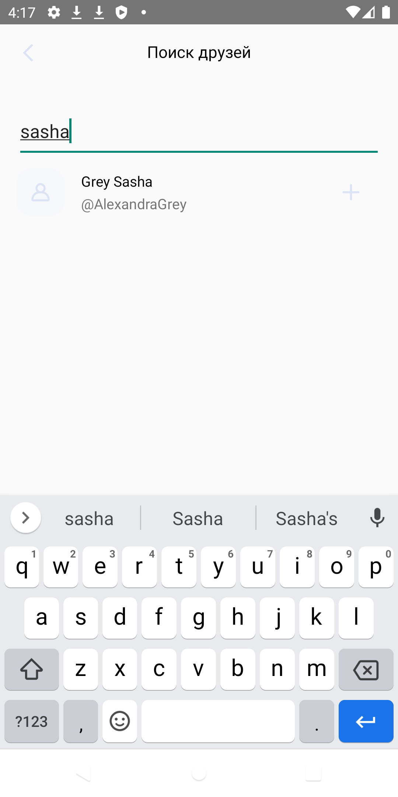

<h1 align="center">  Social places</h1>

[](https://github.com/arkivanov/MVIKotlin/blob/master/LICENSE)

### About

This application is a social network that allows you to share interesting places from anywhere in the world.

### Functional

* ***Registration*** / ***Authorization*** / ***Personal data editing***.
* ***News publication (with/without location)***.
* ***Evaluation of publications***.
* ***Adding/searching for friends***.

### Screens

***Main screens***

| Main screen    | Adding friends     | Profile  |
|---------------------------------------------------|--------------------------------------------------------------|------------------------------------------------------|

***Authorization/ Registration***

| Authorization  | Registration  | Registration  |
|----------------------------------------------------|---------------------------------------------------|---------------------------------------------------|

***Creation/ Viewing posts***

| News feed       | News creation     | Rating of the news  |
|-----------------------------------------------------|----------------------------------------------------------|----------------------------------------------------------------|


### Technologies

* Language: **Kotlin**
* Libraries: **Retrofit 2, Room, Glide, Coroutines, LiveData**
* Pattern: **MVVM**
* Add-ons for **[Coroutines](https://github.com/Kotlin/kotlinx.coroutines)**

## Install

Recommended version **Gradle** - 5.3.

Write in the terminal, then initialize the project using ***Android Studio***:

```git
git clone https://github.com/l1ve4code/social-places.git
```

Modules in the project:

- `play-services-location` - library for working with geo-location.
- `glide` - a library for uploading images, videos, and animated GIFs.
- `room` - the Object-relational Mapping (ORM) library.
- `retrofit2` - REST-client for Java and Android.
- `kotlinx-coroutines-android` - a mechanism for performing asynchronous operations.
- `lifecycle-livedata-ktx` - a tool for linking the state of data and objects to the lifecycle.


## Author

* Telegram: **[@live4code](https://t.me/live4code)**
* Email: **steven.marelly@gmail.com**
